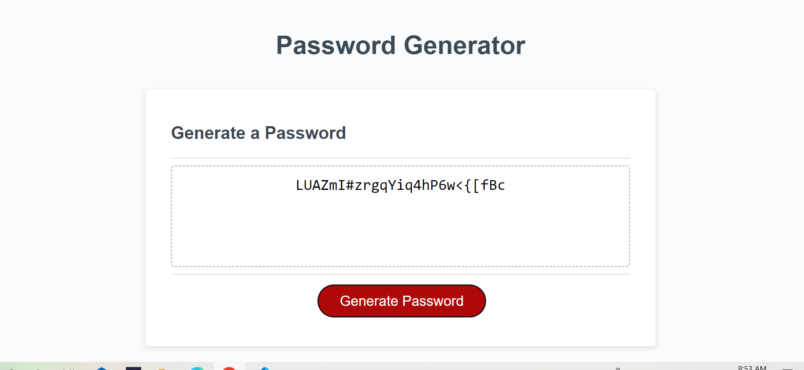

# Password Generator

## Installation
N/A

[To visit my passwordGenerator Web Site]( https://ajilakj.github.io/PasswordGenerator/)

## Usage
- To use this website you can click the generate password button.
- You will prompt to select a number between 8 and 128. if the number is not in the range or you enter something other than a number the same prompt again will appear for user to enter the password length
- If the password length entered is in the range, user will prompt to select lowercase, uppercase, numbers or symbols. If the selection didn't contain any of these user will again prompt to  select.
- if it contains at least one of the 4, a password based on the user's selection will generate in the text area.

## Credits
N/A

## License
N/A
